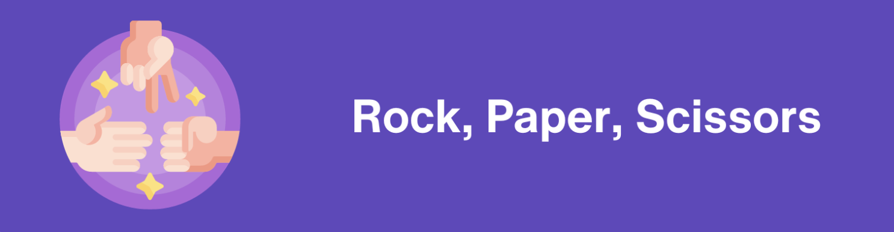

# Rock, Paper, Scissors Game

This repository contains two implementations of the classic Rock, Paper, Scissors game:
* **Functional Approach**: This approach uses functions to define the different parts of the game logic.
* **OOP Approach**: This approach uses classes to encapsulate the game logic and state.

This Python implementation of the classic "Rock, Paper, Scissors" game offers a fun and interactive way to play against the computer. 

## Project Structure
```
rock-paper-scissors/
│
├── src/
│   ├── OOP-approach/ 
│       ├── game.py - the main game class
│       ├── README.md 
│   ├── functional-approach/
│       ├── game.py
│       ├── README.md 
├── images/
│   ├── project-image.png
│
└── README.md
````
## Requirements
1. Python 3.7+

## Features
* Play against the computer.
* User input validation.
* Random computer choice.
* Determine winner based on game rules.
* Play again functionality.

## Running the Project
1. Clone this repository or download the files.
2. Run the desired script:
  * Functional approach: `python src/functional-approach/game.py`
  * OOP approach: `python src/OOP_approach/game.py`


## Playing the Game
1. The game will prompt you to choose Rock, Paper, or Scissors.
2. The computer will randomly choose its action.
3. The winner will be declared based on the game rules.
4. You will be asked if you want to play again.

## Choosing an Approach:

The choice between functional and OOP approaches depends on your preference and the complexity of your game.
* The **functional approach** is simpler and easier to understand for beginners.
* The **OOP approach** is more suitable for larger or more complex games, as it promotes code organization and reusability.

## Developed Skills
* Python classes and object-oriented programming(OOP)
* Python 'random' module
* Game loop and user interaction
* troubleshooting and problem-solving

This repository provides a basic implementation of Rock, Paper, Scissors. Feel free to modify and extend it to add features like scorekeeping, different game modes, or a visual interface.

