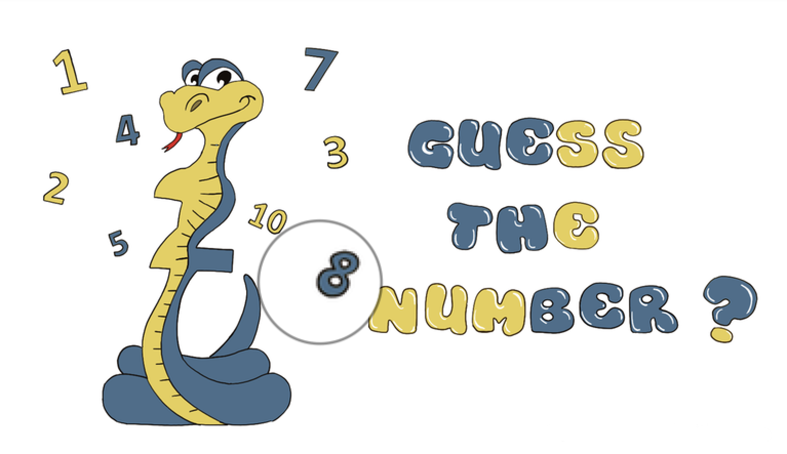

# Number Guesser Game 

## Overview
This is a game that generates a random number between 1 and 100, and the user is prompted to guess this number. For each incorrect guess, the user receives a hint and their score is reduced.

## How to run
Two approaches are applied to run this project:
1. Single script approach
2. Modular approach
You can navigate to your preferred approach directory to run the project.  
